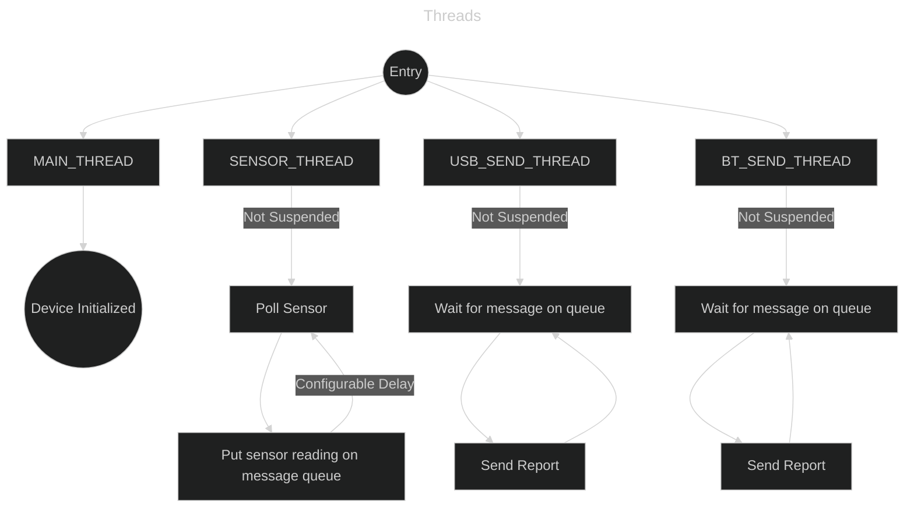
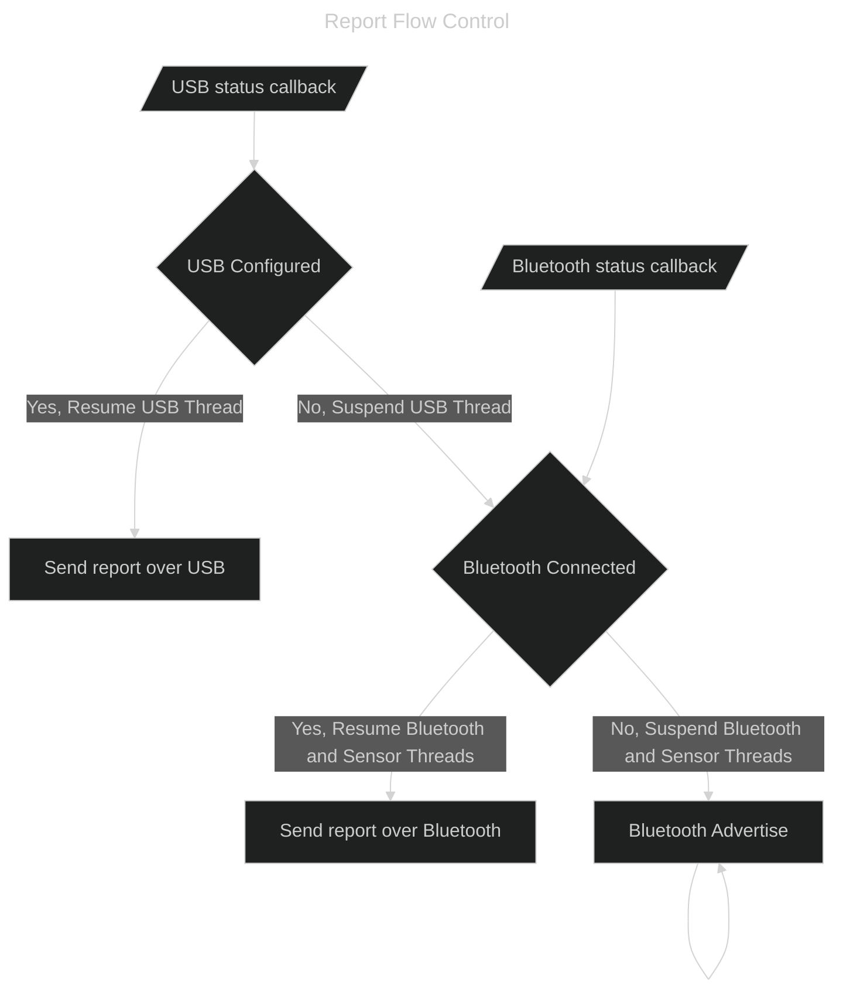

# Scroller: High Resolution Wireless Scroll Wheel

NRF52840 and AMS AS5600 based wireless scroll wheel currently in the MVP state.

## Features
- USB HID High resolution scrolling at 1/120th the typical scroll distance
- Internal scroll accumulation: In regular scrolling mode 120 steps are required per scroll event, In high resolution scrolling mode `SCROLLER_STEPS_HI_RES` steps are required (default: 1 step)

## Planned Features
- Bluetooth HID
- Low power mode for idle state

## Requirements
This project currently depends on the AS5600 driver being upstreamed in [zephyr-drivers/tree/as5600-driver-improvement](https://github.com/c-ewing/zephyr-drivers/tree/as5600-driver-improvement)

Additionally building against a NRF SDK version newer than 3.0.0 is required (Currently built against 3.0.0-rc1)

## Testing

Information about the device can be viewed (on linux) by running:
```sh
# Get the bus and device address
lsusb | grep Scroller

# View the HID descriptor advertised by the device with
usbhid-dump -a [bus]:[address]
```
This report can be parsed with Frank Zhao's [USB Descriptor and Request Parser](http://eleccelerator.com/usbdescreqparser/#)

```sh
# View the stream of reports sent by the device
usbhid-dump -a [bus]:[address] -e stream

# View the kernel level events resulting from the device using evtest and selecting the device
evtest
```

If the device is registering correctly, `evtest` should register two different event types.
`REL_WHEEL` is a standard scroll event while `REL_WHEEL_HI_RES` is 1/120th of the scroll distance of `REL_WHEEL`.
In the [kernel](https://patchwork.kernel.org/project/linux-input/patch/20181205004228.10714-5-peter.hutterer@who-t.net/) `lo_res` events are emitted only once 120 `hi_res` events have accumulated. This lets legacy applications still receive `lo_res`
events, while enabling newer applications to scroll in finer steps. 

## Design Details

Scroller is designed around a single producer (Sensor Thread) and single consumer model (Send Threads). There are two consumers of the sensor values, Bluetooth and USB however only one is enabled at a time. USB connections will always take priority over Bluetooth ones. The following diagrams model the basic control flow of the application code. The first diagram outlines threads while the second the control flow for choosing which send thread to use.




## References
- https://www.usb.org/sites/default/files/hut1_5.pdf # Page 40 for resolution multiplier 
- https://www.usb.org/sites/default/files/documents/hid1_11.pdf # HID Specification
- http://eleccelerator.com/usbdescreqparser/# # HID Report parser
- https://docs.zephyrproject.org/latest/doxygen/html/group__usb__hid__mk__report__desc.html # Zephyr HID documentation
- https://github.com/qmk/qmk_firmware/issues/17585 # QMK High Resolution scrolling Report 
- https://download.microsoft.com/download/b/d/1/bd1f7ef4-7d72-419e-bc5c-9f79ad7bb66e/wheel.docx # Windows High resolution scrolling
- https://patchwork.kernel.org/project/linux-input/patch/20181205004228.10714-5-peter.hutterer@who-t.net/ # Linux kernel high resolution scrolling matching the windows implementation

